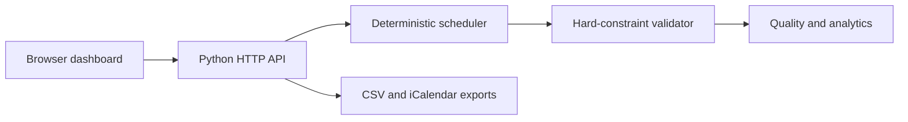

# Architecture

```mermaid
flowchart LR
  UI[Browser dashboard] --> API[Python HTTP API]
  API --> Solver[Deterministic scheduler]
  Solver --> Validator[Hard-constraint validator]
  Validator --> Report[Quality and analytics]
  API --> Export[CSV and iCalendar exports]
```

The validator is the safety boundary. Every generated or changed schedule is validated before it is presented as feasible.
